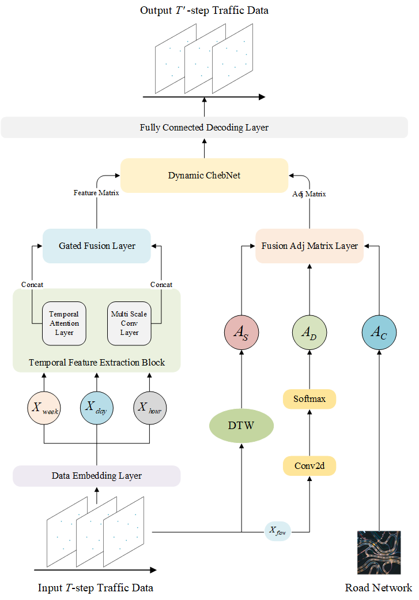
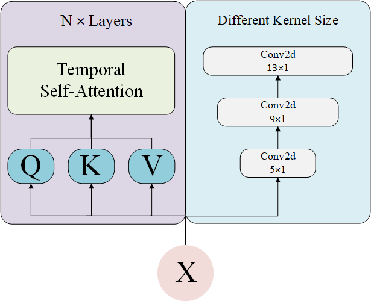

# Traffic Flow Prediction Based on Temporal Attention and Multi-Graph Adjacency Fusion Using DynamicChebNet
___


## Requirement
___
The experiments were conducted using an RTX 3090GPU for training, based on Ubuntu 20.04, with Pytorch 2.0.0 and Python 3.8 for implementing the TMDCN model.

Please make sure you have installed Python and PyTorch correctly. Then you can install all the dependencies with the following command by pip:
```shell
pip install -r requirements.txt
```

To install pytorch-geometric, follow these steps:<br>
- make sure to choose the correct version of PyTorch based on your CUDA version if you're using a GPU.
- install the four dependencies in sequence: torch_scatter, torch_sparse, torch_cluster, and torch_spline_conv. Go to [https://data.pyg.org/whl/](https://data.pyg.org/whl/) and download the .whl file.
- enter the installation directories of the above four dependencies and execute the command (for example, replace the specific file name.) :
  ```shell
  pip install torch_scatter-2.0.7-cp37-cp37m-win_amd64.whl
  ```
- install torch_geometric:
  ```shell
  pip install torch_geometric
  ```
## Structure
___
``` 
|- TMDCN
    |- configuration (Configuration File, you can configure all parameters related to training.)
        - PEMS04.conf
        - PEMS08.conf
    |- dataset
        |- PEMS04
            - PEMS04.csv (Download File, download the corresponding dataset and place it in this folder.)
            - PEMS04.npz (Download File, download the corresponding dataset and place it in this folder.)
            - PEMS04_cost_adj_matrix.pt (Generated File, generated by running the static_adj_matrix.py.)
            - PEMS04_similarity_adj_matrix.pt (Generated File, generated by running the static_adj_matrix.py.)
            - PEMS04_w1_d1_h1.npz (Generated File, generated by running the feature_matrix.py.)
        |- PEMS08 (Same as PEMS04)
            - ...
    |- lib
        |- config_loader.py (Set command-line parameters and read configuration files.)
        |- cost_adj_matrix.py
        |- dataloader.py (Load and preprocess the dataset for training and evaluation.)
        |- metrics.py (Define evaluation metrics, such as MAE, MAPE, RMSE, for model performance.)
        |- similarity_adj_matrix.py
        |- utils.py
    |- model
        - ...
    |- run
        |- train (Directory containing training-related outputs and configurations.)
            |- exp-1 (training name)
                |- tensorboard
                    - ...
                |- log
                    - ...
                |- checkpoint
                    - ...
                - PEMS04_config_backup.conf
            |- exp-2
            |- exp-3
            |- ...
    - feature_matrix.py (This code is based on the open-source project: https://github.com/guoshnBJTU/ASTGCN-2019-pytorch.)
    - static_adj_matrix.py
    - train.py
```
## Dataset
___
- download PEMS04 and PEMS08 datasets provided by [ASTGNN](https://github.com/guoshnBJTU/ASTGNN/tree/main/data).
- taking PEMS04 as an example, you must place the downloaded PEMS04.csv and PEMS04.npz files into the PEMS04 folder under the dataset directory.
- run feature_matrix.py and static_adj_matrix.py to generate PEMS04_cost_adj_matrix.pt, PEMS04_similarity_adj_matrix.pt, and PEMS04_w1_d1_h1.npz.
## Train
___
- on PEMS04 dataset:
  ```shell
  python train.py --dataset PEMS04
  ```
- on PEMS08 dataset:
  ```shell
  python train.py --dataset PEMS08
  ```

You can run this command to start tensorboard (for example, replace the specific training name.) :
```shell
tensorboard --logdir=run/train/exp-1/tensorboard
```

If you want to continue with the previous training, please modify the parameters of the configuration file (for example, replace the specific training name.) :
```
continue_training = True
continue_training_name = exp-1
```